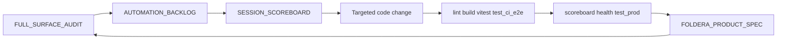

# Audit remediation roadmap — living program

**Purpose:** Single scannable view of the April 2026 full-surface audit closure **loop**: what is **done** (Phases A–C), what is **pending** (D–G), and **how to tackle** each bucket. Historical detail stays in [AUTOMATION_BACKLOG.md](../AUTOMATION_BACKLOG.md); point-in-time inventory stays in [FULL_SURFACE_AUDIT_2026-04-07.md](./FULL_SURFACE_AUDIT_2026-04-07.md).

## Outstanding backlog — severity (summary)

Full table at the **top** of [AUTOMATION_BACKLOG.md](../AUTOMATION_BACKLOG.md). Abbreviated:

| Severity | Scope |
|----------|--------|
| **S0** | Prod/deploy/health/scoreboard red; unapplied prod migrations |
| **S1** | AZ-24 pipeline mix; REVENUE_PROOF Gate 4 / Stripe; `ALLOW_EMAIL_SEND` |
| **S2** | Phases D–G operational items; OPEN monitors; CI `/login` flake; AZ-14 |
| **S3** | Remaining AZ operator polish (uptime, UX sweep, backups, etc.) |

**Triage order:** Fix **S0** first when *executor-run* checks show deploy/health/scoreboard/migration failure. When S0 is green, prioritize **S1** for business/GTM — the agent still drives receipts and automation; human steps are the narrow exceptions listed at the top of [AUTOMATION_BACKLOG.md](../AUTOMATION_BACKLOG.md) (ship contract).

## Source of truth

| What | Where |
|------|--------|
| OPEN bullets + mitigated monitors | [AUTOMATION_BACKLOG.md](../AUTOMATION_BACKLOG.md) — sections `OPEN (…)` and `### OPEN (normalized …)` |
| Normalized ranked table (AZ-*) | [AUTOMATION_BACKLOG.md](../AUTOMATION_BACKLOG.md) — table after line ~742 |
| Audit §6 scoreboard / §7 npm audit / Appendix B | [FULL_SURFACE_AUDIT_2026-04-07.md](./FULL_SURFACE_AUDIT_2026-04-07.md) |
| Scoreboard SQL + ritual | [SESSION_SCOREBOARD.md](./SESSION_SCOREBOARD.md) |
| Operator links (Vercel, Sentry, Stripe, Gate 4) | [MASTER_PUNCHLIST.md](./MASTER_PUNCHLIST.md) |
| A–Z matrix (Green/Yellow/Red) | [AZ_AUDIT_2026-04.md](./AZ_AUDIT_2026-04.md) |

## How audit items get tackled (one loop)

**Pick work:** Red scoreboard / production errors first; then audit Yellow rows (coverage gaps); then operator items (Sentry, UptimeRobot, Stripe, etc.) that code cannot close alone.

**Close the loop:** After each slice, update spec evidence for touched spec items, append `SESSION_HISTORY.md`, refresh `WHATS_NEXT.md`, and adjust the audit doc if status changed (e.g. Section 6 scoreboard/migrations).

---

## Phase A — Database / scoreboard

**Status: complete** (operator-confirmed migrations + code paths shipped).

- **DDL / ops:** `pipeline_runs`, `user_brief_cycle_gates`, `directive_ml_moat` (`outcome_label`) — see [AUTOMATION_BACKLOG.md](../AUTOMATION_BACKLOG.md) DONE blocks *Pipeline observability* and *Production user_brief_cycle_gates*.
- **Evidence:** [FULL_SURFACE_AUDIT_2026-04-07.md](./FULL_SURFACE_AUDIT_2026-04-07.md) §6 — `npm run scoreboard` **Green (post-audit)**.
- **Follow-up:** Re-run `npm run scoreboard` on the linked DB after any prod DDL drift or deploy; if red, fix before claiming pipeline sessions done.

---

## Phase B — Pipeline hotfixes

**Status: complete** (code + tests; production monitoring continues).

| Item | Shipped (summary) | Tests / modules |
|------|-------------------|-----------------|
| **B1** — Signal batch `Invalid time value` | Per-signal try/catch in `processBatch`, `signal_processor_single_signal_failed`; hardened `normalizeInteractionTimestamp`; parseable `extracted_dates` only | `lib/signals/__tests__/signal-processor.test.ts` |
| **B2** — Locked contact pre-filter vs artifact | `locked_contact_pre_filter` in scorer; user-facing artifact scan + word boundaries — `lib/briefing/locked-contact-scan.ts` | `lib/briefing/__tests__/locked-contact-scan.test.ts` |
| **B3** — Stale dates in directive | `directiveHasStalePastDates` + `userFacingStaleDateScanText` (incl. slash ISO); generator gate | `lib/briefing/__tests__/scorer-failure-suppression.test.ts` |

**Post-ship:** Monitor prod for `locked_contact_in_artifact` vs `locked_contact_pre_filter` (Phase F).

---

## Phase C — Audit “Yellow” / CI coverage

**Status: complete.**

- **`/dashboard/signals`:** Minimal authenticated CI coverage — `tests/e2e/authenticated-routes.spec.ts` (`setupSignalsPageMocks`); included in `playwright.ci.config.ts` scope. Audit §3 matrix marks route Green.

---

## Phase D — Observability and dependency hygiene

**Status: pending** (operator + scheduled work).

| Item | Owner | How to tackle |
|------|--------|----------------|
| **Sentry 7d triage** | Operator | Use `SENTRY_AUTH_TOKEN` + Sentry dashboard; fix top issues or add OPEN bullets in backlog |
| **Vercel deploy verified** | Operator | Latest production deployment **Ready** before claiming prod verification; see [MASTER_PUNCHLIST.md](./MASTER_PUNCHLIST.md) |
| **`npm audit`** | Scheduled / major upgrade | Do not `npm audit fix --force`; align **Next.js + eslint-config-next + eslint** together per [CLAUDE.md](../CLAUDE.md); audit §7 snapshot (~13 issues) |

Audit §6 still lists Sentry and Vercel as **Not verified** until operator completes triage / deploy checks.

---

## Phase E — GTM / operator backlog (normalized AZ table)

**Status: pending** for unresolved ranks. Full matrix: [AZ_AUDIT_2026-04.md](./AZ_AUDIT_2026-04.md). Operator checklist: [MASTER_PUNCHLIST.md](./MASTER_PUNCHLIST.md).

| Rank | ID | Title | Owner | Spec § | Evidence / notes | Next action |
|------|-----|--------|-------|--------|------------------|-------------|
| 1 | **AZ-24** | Pipeline: actionable share vs `do_nothing` / `research` | Agent | §1.1 / matrix G | Receipt + slices 1–3 shipped (thread gate, freshness union, signal_velocity → `make_decision`). | Vercel **Ready** operator check; re-run action-type SQL (`az05` script); Anthropic healthy; drain legacy `research` rows if still dominant |
| 2 | **AZ-04** | Real non-owner production depth | Operator | §1.3 | `NON_OWNER_DEPTH` | Second Google user: connect, brief, confirm `tkg_actions` row |
| 3 | **AZ-08** | UptimeRobot on `/api/health` | Operator | §1.2 | External uptime | [MASTER_PUNCHLIST.md](./MASTER_PUNCHLIST.md) |
| 4 | **AZ-09** | FLOW UX screenshot sweep | Operator | CLAUDE QA | Manual | Key routes + 404 |
| 5 | **AZ-11** | Stranger onboarding (live OAuth) | Operator | §1.3 | Manual | Recorded flow optional |
| 6 | **AZ-14** | `tests/production/auth-state.json` refresh | Operator | test:prod | ~30-day JWT | `npm run test:prod:setup` |
| 7 | **AZ-16** | Stripe checkout + webhook | Operator | §1.4 | — | Verify `user_subscriptions`; [REVENUE_PROOF.md](../REVENUE_PROOF.md) |
| 8 | **AZ-17** | Supabase leaked-password protection | Operator | Security | Pro-gated | Supabase dashboard toggle |
| 9 | **AZ-18** | 3 consecutive useful cron directives | Operator | §1.1 | Quality bar | Monitor nightly email |
| 10 | **AZ-19** | Owner account: scopes + focus | Operator | Product | — | Reconnect OAuth; UI focus areas |
| 11 | **AZ-21** | Supabase backups / PITR | Operator | DR | — | Dashboard per plan |

Closed reference rows (AB-25, AZ-02, AZ-03, etc.) remain in [AUTOMATION_BACKLOG.md](../AUTOMATION_BACKLOG.md) for history.

---

## Phase F — Monitoring (mitigated, not formally closed)

| Theme | Backlog pointer | How to tackle |
|-------|-----------------|---------------|
| **`stale_date_in_directive`** | [AUTOMATION_BACKLOG.md](../AUTOMATION_BACKLOG.md) OPEN (mitigated — monitor) | Watch new `send_message` / `write_document` + email HTML; re-open if stale ISO appears in **finished artifact** visible in email (`renderArtifactHtml` paths) |
| **Locked contact: pre-filter vs post-LLM gate** | DONE roadmap + prod logs | Compare `locked_contact_pre_filter` vs `locked_contact_in_artifact`; tighten [locked-contact-scan.ts](../lib/briefing/locked-contact-scan.ts) / generator only with new evidence |
| **`generation_retry_storm`** | DONE loop gate + **Monitor** note | Watch `api_usage` `directive_retry` vs `directive` after deploy; re-open if storm persists |

---

## Phase G — CI / local reliability

| Item | Backlog pointer | How to tackle |
|------|-----------------|---------------|
| **Local `test:ci:e2e` `/login` HTTP 500** | [AUTOMATION_BACKLOG.md](../AUTOMATION_BACKLOG.md) OPEN (2026-04-05) | Align **`NEXTAUTH_URL`** with Playwright **`baseURL`** — `http://127.0.0.1:${WEB_PORT}` not `localhost` (see [playwright.ci.config.ts](../playwright.ci.config.ts)); reproduce with `next start` stderr if still failing |

---

## Verification ritual (every implementation session)

1. `npm run health` — paste output; fix FAIL rows first if in scope.
2. `npm run scoreboard` — green after Phase A (and after B-style fixes if rows move).
3. `npm run lint`, `npm run build`, `npx vitest run --exclude ".claude/worktrees/**"`, `npm run test:ci:e2e`.
4. After push: Vercel **Ready**, GitHub **green**, `npm run test:prod` when `tests/production/auth-state.json` is fresh (`npm run test:prod:setup` if needed).
5. Update `FOLDERA_PRODUCT_SPEC.md`, `SESSION_HISTORY.md`, `WHATS_NEXT.md`; refresh audit §6 / Appendix B if facts changed.

---

## Suggested execution order (next sessions)

1. **Operator quick wins:** Sentry triage (top issues), confirm Vercel **Ready**, `npm run test:prod:setup` if auth state stale (**AZ-14**).
2. **Agent:** **AZ-24** follow-up — SQL receipt (`scripts/az05-action-type-distribution.sql` or equivalent) + optional code if metrics flat after deploy.
3. **Agent:** **Phase G** — reproduce `/login` CI flake; fix env / NextAuth or document definitive workaround.
4. **Ongoing:** **AZ-04, AZ-08, AZ-11, AZ-16–AZ-19, AZ-21** per [MASTER_PUNCHLIST.md](./MASTER_PUNCHLIST.md).

---

## Related docs

- [FULL_SURFACE_AUDIT_2026-04-07.md](./FULL_SURFACE_AUDIT_2026-04-07.md) — snapshot inventory + Appendix B
- [AUTOMATION_BACKLOG.md](../AUTOMATION_BACKLOG.md) — authoritative OPEN/DONE log
- [MEGA_PROMPT_PROGRAM.md](./MEGA_PROMPT_PROGRAM.md) — sequenced S1–S9 / Gate 4 operator checklist
- [SESSION_SCOREBOARD.md](./SESSION_SCOREBOARD.md) — production SQL + scoreboard command
